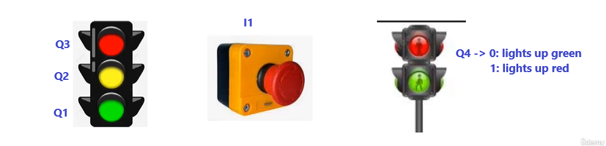

# 
  Traffic Light

## Goal

This is a traffic light project that I have created as one of the projects required in the course [Treinamento em Lógica Ladder para CLP/PLC](https://www.udemy.com/course/treinamento-em-logica-ladder-para-plc/)

## Requirements 

The requirements to this project are described in the image bellow. 

## Implementation 

The program was created using ZelioSoft2 software, which is one of the software created by Schneider Electrics for Ladder programming on their Zelio series PLCs.

To implement this project, I have used the CLP which reference is SR2A101BD. This SCLP has four digital outputs named Q1, Q2, Q3 and Q4. And it has four digital inputs named I1, I2, I3 and I4. I have associated the button required to input I1 and each one of the outputs with each one of the lights bulbs from the traffic lights as shown in the picture bellow

I have created diferent versions of the solution which each one of them I have saved in specific development branches. The cleanest and best solution I have saved in the main branch.

## Notes and Concepts Learned  

I noticed that use the same output throught the code causes problems due to scan cycle. I have noticed that the due to the scan cyle executed by the PLC the last line of code that changes an determined output prevails over the others line of code that works on the same output. 

I have worked with the Set and Reset coils and remembered how Active on Edge coil works. That was good because I had just fixed how to work with the Active On State coil. 

It was very good working with timers and thinking about what kind of timer I should use to solve the problem. 

