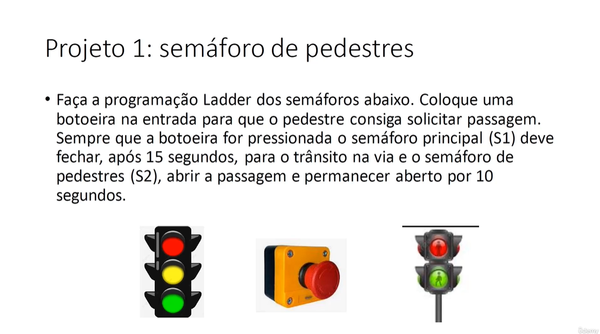

# 
  Traffic Light

## Goal

This is a traffic light project that I have created as one of the projects required in the course [Treinamento em Lógica Ladder para CLP/PLC](https://www.udemy.com/course/treinamento-em-logica-ladder-para-plc/)

The program was created using ZelioSoft2 software, which is one of the software created by Schneider Electrics for Ladder programming on their Zelio series PLCs.

## Requirements 

The requirements to this project are described in the image bellow. 

## Concepts Learned and Notes

